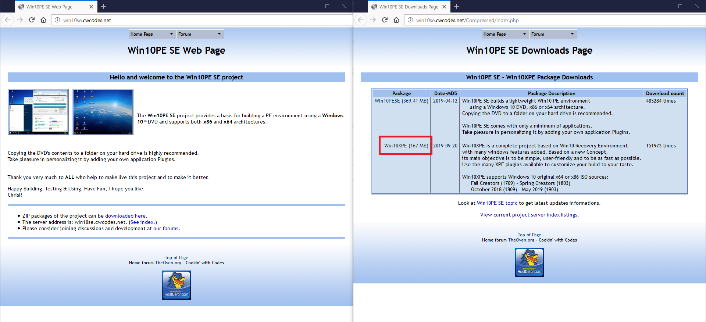

# 친절한 사용자 매뉴얼: PEBakery 사용법

‹[친절한 소개: PEBakery에 대하여](/k-intro)› 는 읽고 오셨나요?

모든 것을 시작하기 전에, 윈도우 PE를 만들 때 가장 중요한 세 가지에 대해 알려 드리겠습니다.

- 윈도우 설치 디스크 (USB 메모리) 원본, 또는 그 이미지
- 윈도우 PE에 추가할 것들
- 어떻게 추가할 것인가?

물론 PEBakery를 빠뜨릴 수 없습니다. PEBakery가 바로 "어떻게 추가할 것인가?"를 해결해 주는 부분이기 때문입니다.

## 윈도우 10으로 윈도우 PE 만들기

윈도우 10으로 시작하겠습니다. [Win10PE SE 프로젝트 페이지](http://win10se.cwcodes.net/)에서, **Win10XPE**를 다운로드해 보세요. Win10PE SE 프로젝트에서 이미 PEBakery를 사용하고 있기 때문에, Win10XPE를 다운로드하면 PEBakery를 추가로 받을 필요는 없습니다.

아래 그림에서 빨간 색으로 네모 친 부분을 클릭하여 Win10XPE를 받을 수 있습니다.

Win10XPE를 다운로드하면 "추가할 것들"과 "어떻게 추가할 것인가?"의 좋은 샘플을 확보하게 됩니다. 그래서 Win10XPE를 이용해 윈도우 10 기반의 윈도우 PE를 만들 수 있습니다.

Win10XPE는 PEBakery가 중요하게 생각하는 윈도우 PE 프로젝트이지만, 공식적으로 Win10XPE를 사용하여도 아무 문제가 없을 것이라고 보장해 드릴 수는 없는 점을 주의해 주세요. Win10XPE로 윈도우 PE를 만들다가 문제가 생긴다면, PEBakery에 끼어든 실수 탓일 수도 있고, WIN10XPE에 끼어든 실수 탓일 수도 있습니다. 항상 백업을 생활화해 주세요.

사실은 이렇습니다: Win10XPE는 PEBakery를 포함해 배포되지 않습니다. 그러므로 이 예제는 틀렸습니다.

(작성 중)

